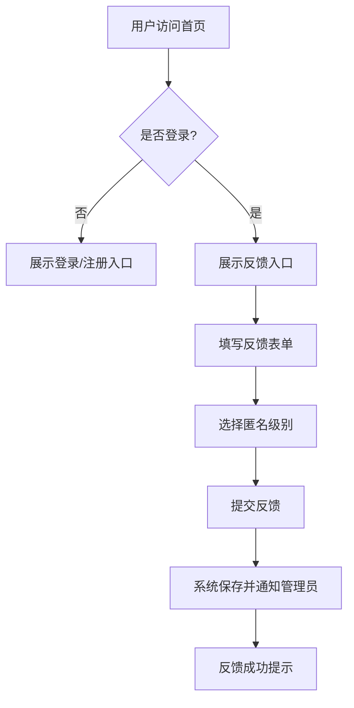
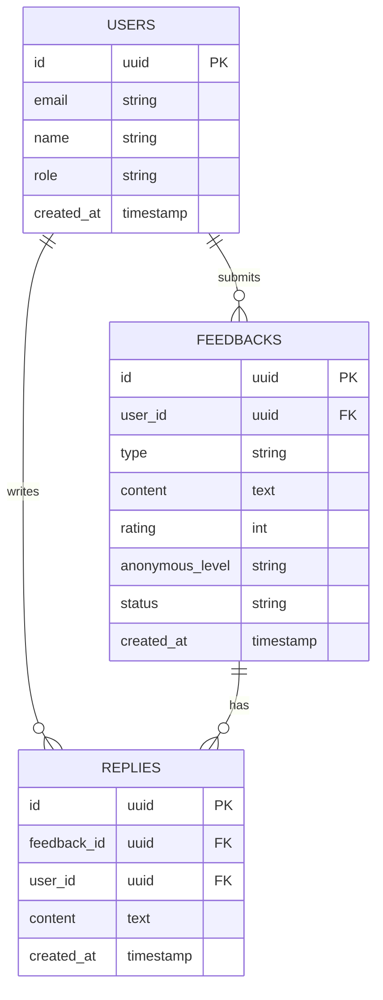

## 1. 产品概述

Candor 是一款职场匿名反馈工具，旨在帮助团队成员在匿名环境下提供真实、有价值的反馈，促进团队沟通和协作改进。通过匿名机制消除心理障碍，让员工敢于表达真实想法，帮助管理者了解团队真实状况。

## 2. 核心功能

### 2.1 用户角色
| 角色 | 注册方式 | 核心权限 |
|------|----------|----------|
| 普通用户 | 邮箱/企业邮箱注册 | 提交匿名反馈、查看反馈回复、浏览反馈统计 |
| 管理员 | 管理员邀请 | 管理团队成员、查看所有反馈、回复反馈、导出数据 |

### 2.2 功能模块
1. **首页**：展示反馈入口、统计概览、快速提交入口
2. **反馈提交页**：匿名反馈表单，支持文字和评分
3. **反馈列表页**：查看反馈历史和回复状态
4. **统计分析页**：团队反馈数据分析可视化
5. **设置页**：个人设置、通知偏好

### 2.3 页面详情
| 页面名称 | 模块名称 | 功能描述 |
|----------|----------|----------|
| 首页 | Hero区域 | 展示产品价值主张、快速开始按钮 |
| 首页 | 统计卡片 | 展示反馈数量、回复率、满意度等关键指标 |
| 反馈提交页 | 匿名表单 | 选择反馈类型、填写内容、评分（1-5星） |
| 反馈列表页 | 反馈列表 | 按状态筛选、查看详情、追踪回复进度 |
| 统计分析页 | 数据图表 | 反馈趋势、分类分布、情绪分析可视化 |
| 设置页 | 账户设置 | 修改密码、通知偏好、注销账户 |

## 3. 核心流程

### 3.1 用户提交反馈流程
用户进入首页 → 点击"提交反馈" → 选择反馈类型（工作环境/同事协作/管理层/其他） → 填写详细内容 → 选择匿名级别 → 提交 → 确认提交成功

### 3.2 管理员处理反馈流程
管理员登录 → 查看未处理反馈列表 → 选择反馈查看详情 → 撰写回复 → 标记处理状态（已阅读/处理中/已解决）



## 4. 用户界面设计

### 4.1 设计风格
- **主色调**：专业蓝紫色系（#6366f1 主色，#8b5cf6 辅助色）
- **按钮风格**：圆角矩形，hover时有阴影变化
- **字体**：Inter 无衬线字体，标题18-24px，正文14-16px
- **布局风格**：卡片式布局，清晰的信息层级
- **图标风格**：简洁线性图标（Lucide React）

### 4.2 页面设计概览
| 页面名称 | 模块名称 | UI元素 |
|----------|----------|--------|
| 首页 | Hero区域 | 渐变背景、大标题、行动按钮 |
| 首页 | 统计卡片 | 数字展示、趋势箭头、图标 |
| 反馈提交页 | 表单区域 | 下拉选择、文本输入框、评分组件 |
| 反馈列表页 | 列表项 | 卡片布局、状态标签、时间戳 |
| 统计分析页 | 图表区域 | 柱状图、饼图、时间线 |

### 4.3 响应性设计
- **桌面端**：多栏布局，侧边导航
- **平板端**：两栏布局，紧凑导航
- **移动端**：单栏布局，底部导航栏

## 5. 技术架构

### 5.1 架构设计
```mermaid
layeredGraph LR
    subgraph Frontend
        React --> TanStackRouter
        React --> TailwindCSS
        React --> RadixUI
    end
    subgraph Backend
        Supabase[Supabase Auth/Database/Storage]
        Cloudflare[Cloudflare Workers]
    end
    subgraph External Services
        OpenAI[OpenAI API]
    end
    Frontend --> Backend
    Backend --> External Services
```

### 5.2 技术栈
- **前端**：React 19 + TanStack Router + Tailwind CSS 4
- **后端**：Supabase（认证、数据库、存储）+ Cloudflare Workers
- **数据库**：PostgreSQL（Supabase托管）
- **AI服务**：OpenAI API（反馈分析）

### 5.3 路由定义
| 路由 | 用途 |
|------|------|
| / | 首页，展示统计和快速入口 |
| /inbox | 反馈收件箱，查看反馈列表 |
| /r/$linkId | 反馈链接，用于外部提交 |
| /thanks/$replyToken | 感谢页面，反馈提交成功 |
| /privacy | 隐私政策页 |

### 5.4 数据模型


## 6. 安全与隐私

### 6.1 匿名机制
- 支持多级匿名：完全匿名、部门匿名、仅管理员可见
- 反馈内容经过脱敏处理，无法追溯提交者身份

### 6.2 数据安全
- 传输层加密（HTTPS）
- 数据存储加密
- 定期数据备份
- 访问日志审计

### 6.3 隐私合规
- GDPR 合规
- 用户数据可删除
- 隐私政策透明

## 7. 非功能需求

### 7.1 性能指标
- 页面加载时间 < 2秒
- 反馈提交响应时间 < 500ms
- 支持1000+并发用户

### 7.2 可用性
- 99.9% 服务可用性
- 7x24小时运行

### 7.3 扩展性
- 支持多团队/多租户
- 可扩展的反馈类型
- 支持第三方集成（Slack、钉钉等）